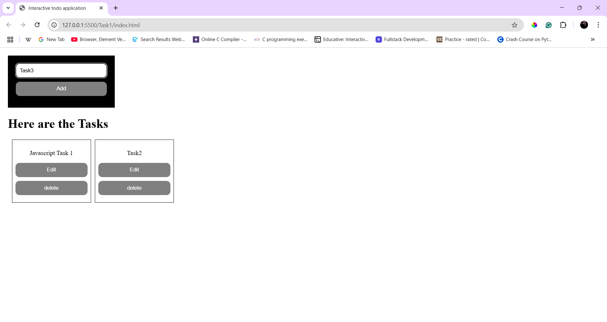
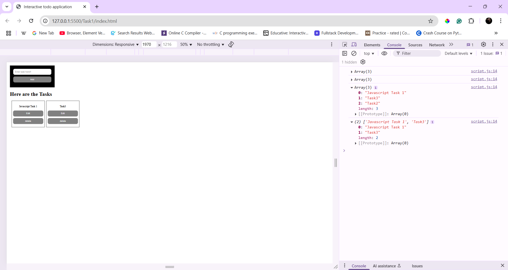
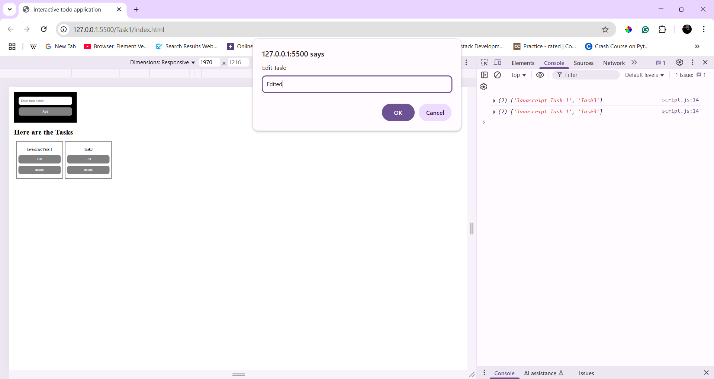
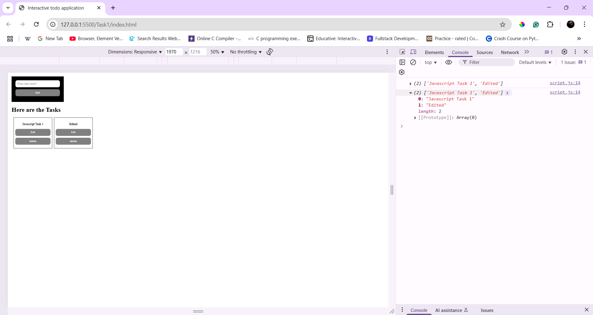

# Interactive To-Do List Application

## Overview
A simple to-do list app that allows users to add, edit, and delete tasks. Tasks are stored in **localStorage**, ensuring they persist even after refreshing the page.

## Features
- Add new tasks dynamically.
- Edit or delete tasks.
- Persistent storage using **localStorage**.
- Responsive design using **CSS**.

## How to Use
1. Type a task into the input box and click "Add".
2. Click "Edit" to modify a task.
3. Click "Delete" to remove a task.

## Technologies Used
- HTML
- CSS
- JavaScript (DOM Manipulation & Local Storage)

## New Things Learned
#### **LocalStorage** – Brushed up on the concept and methods:  
  - `setItem()`, `getItem()`, `removeItem()`, and `clear()`.  
#### **DOM Manipulation** – Learned how to manipulate the DOM using JavaScript.  
#### **Array Methods** – Focused on key methods:  
  - `push()`, `splice()`, `forEach()`, `map()`, and `filter()`.  
#### **Template Literals** – Used **`${}`** to dynamically insert values into HTML.

## Outputs

#### 1. Task input and Task list

#### 2. Deleting the added task
- Also printed in the console for verification.

#### 3. Editing the added task
- Used a prompt to edit tasks.

#### 4. After editing the task
- Also printed in the console for verification.

