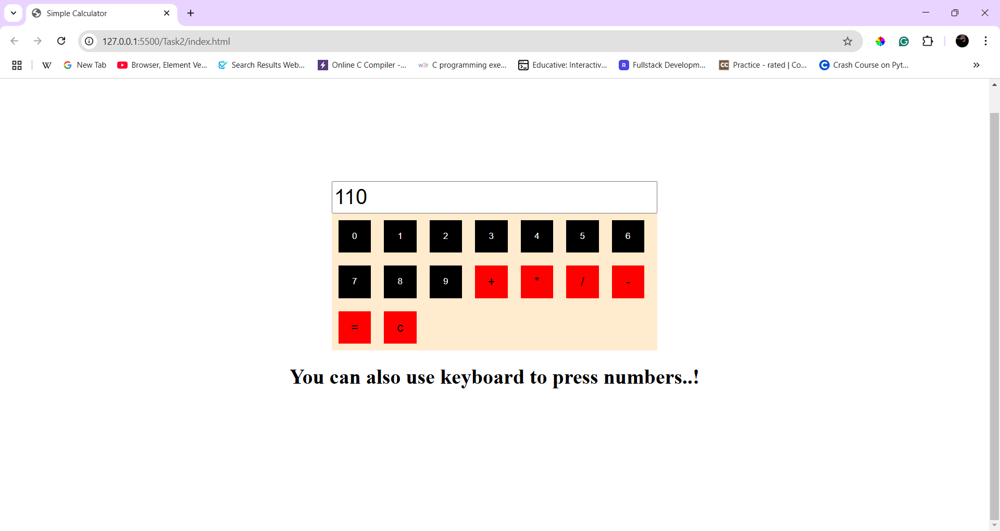

# Simple Calculator

## Overview
A basic calculator built using HTML, CSS, and JavaScript that supports arithmetic operations and allows both button clicks and keyboard input.

## Features
- Supports **addition, subtraction, multiplication, and division**.
- Users can **click buttons** or **use the keyboard** for input.
- Clear (`C`) button to reset the calculator.
- Responsive UI with a simple and clean design.

## How to Use
1. Click the buttons or use your keyboard to input numbers and operators.
2. Press `=` or `Enter` to calculate the result.
3. Press `C` to clear the input field.

## Technologies Used
- **HTML** – Structure of the calculator.
- **CSS** – Styling for buttons and layout.
- **JavaScript** – Logic for calculations and event handling.

## New Things Learned
#### **Keyboard Event Handling** 
– Used `keydown` event to capture user input.
- Check in `script.js` file (https://github.com/Nithishvikky/Javascript/blob/main/Task2/script.js#L18-L26)
```js
document.addEventListener("keydown",(e)=>{
     const btn = e.key;
     if(numbers.includes(btn)){
        place(btn);
     }
     else if(btn==="Enter"){
        place("=");
     }
})
```
#### **DOM Manipulation** 
– Dynamically created buttons and handled click events. Stored the buttons in an array which reduces the HTML usage.
#### **String & Number Operations** 
– Managed user input and arithmetic calculations efficiently.
#### **Algorithm Used** 
- I've created my own algorithm. There might be some edge cases so have to take colser look.
- Check in `script.js` file (https://github.com/Nithishvikky/Javascript/blob/main/Task2/script.js#L55-L81)
```js 
function place(n){
    if(isNaN(Number(n))){
        if(n==="c"){
           res = 0;
           temp = "";
           document.getElementById("inputbox").value = "";
        }
        else if(n!=="="){
            if(temp){
                res = Number(temp);
            }
            op = n;
            document.getElementById("inputbox").value = op;
        }
        else{
            console.log(temp);
            calculate(res,Number(temp),op);
        }
        console.log(res);
        temp="";
    }
    else{
        //numbers
         temp+=n;
         document.getElementById("inputbox").value = temp;
    }
}
```

## Outputs

#### **1. Calculator UI**


#### **2. Performing Calculations**
- You can view the results also in console to verify it.

