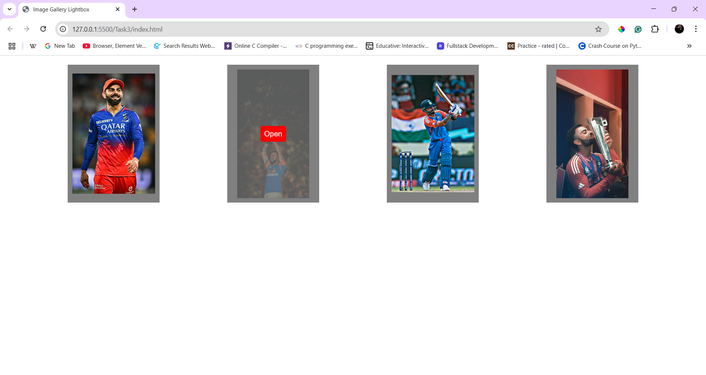
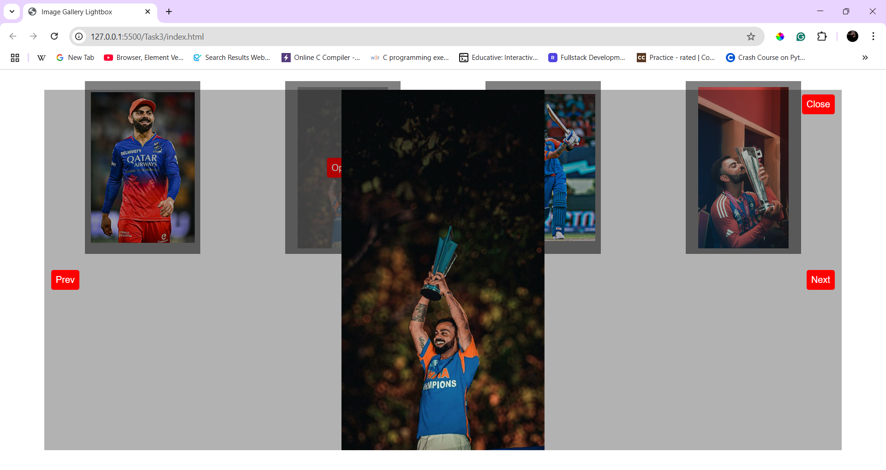

# **Image Gallery Lightbox**  

## **Overview**  
An interactive image gallery where users can click on thumbnails to open a larger version in a **lightbox modal** with navigation controls.  

## **Features**  
- Click thumbnails to **open a full-size image in a modal**.  
- **Next & Previous buttons** to navigate between images.  
- **Smooth fade-in/out transitions** for the lightbox effect.  
- **Close button to exit the modal**.  

## **How to Use**  
1. Click any image thumbnail to **open the lightbox**.  
2. Use the **Next (→) and Prev (←) buttons** to navigate images.  
3. Click **Close** to exit the lightbox.  

## **Technologies Used**  
- **HTML** – Image gallery structure.  
- **CSS** – Lightbox design, animations, and transitions.  
- **JavaScript** – Handles event listeners and dynamic image updates.  

## **New Things Learned**  
- Used `querySelectorAll()` to attach event listeners dynamically.  
- Used **Template Literals** to dynmaically change the images

## **Output**
- Normal gallery view with hover button

- Modal lightbox with next/prev options
