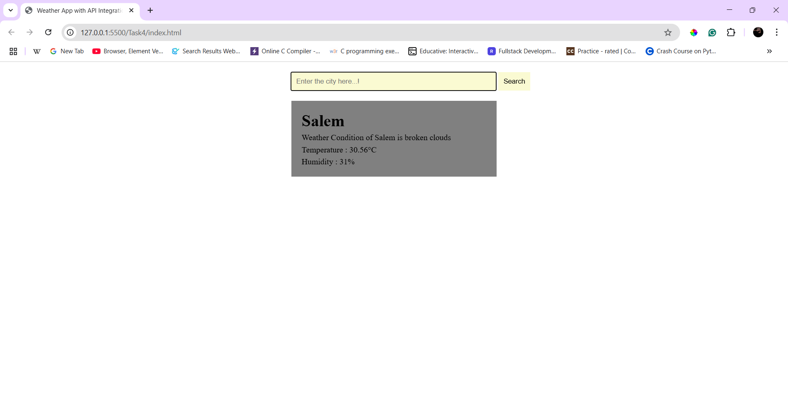
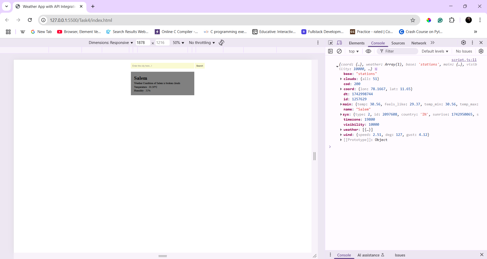

# **Weather App**  

## **Overview**  
A simple weather application that allows users to enter a city name and retrieve real-time weather information using a **public API**. The app displays temperature, humidity, and general weather conditions. 

## **Features**  
- Search weather by city name.  
- Fetch real-time weather data from an API.  
- Display temperature, humidity, and weather condition dynamically.  

## **How to Use**  
1. Enter a **city name** in the input field.  
2. Click the Search button.  
3. View the **current weather details** on the screen.  

## **New Things Learned**  
- Used `fetch()` to retrieve JSON data from an API.
- Dynamically updated the DOM using JavaScript.
- Implemented basic error handling for network requests.

## **Output**
- Showing weather details

- Console view
