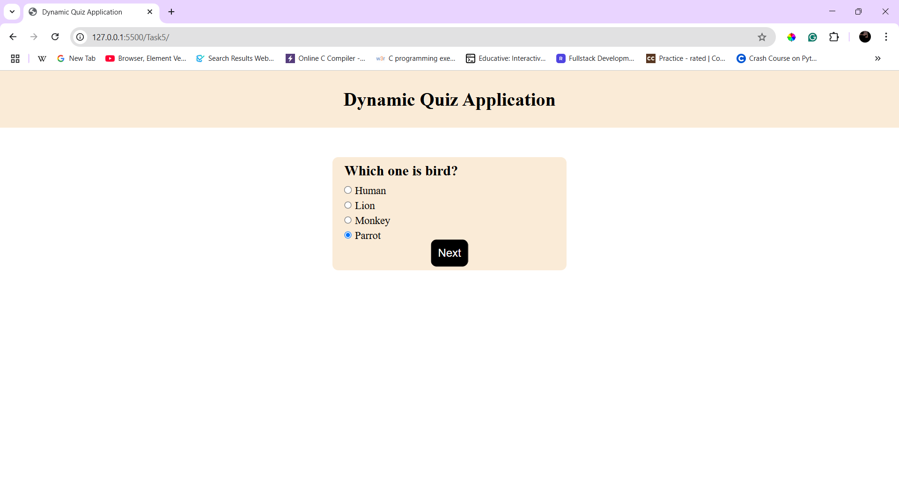
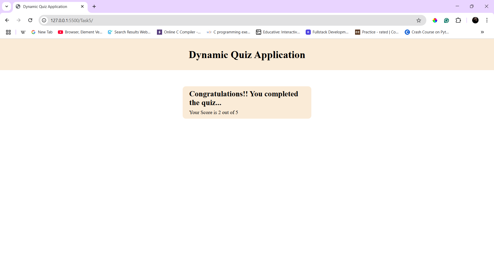
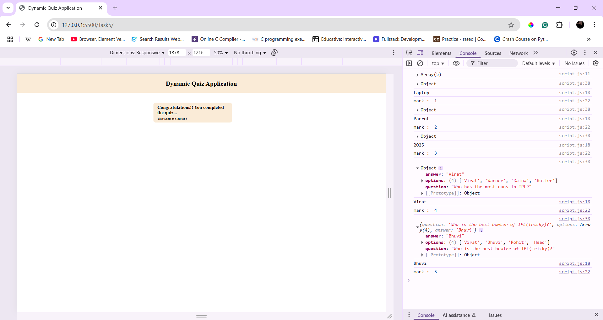

# Dynamic Quiz Application

## Overview
This is a simple **Dynamic Quiz Application** built using HTML, CSS, and JavaScript. It dynamically loads questions from an external **JSON file** and tracks the user's score. 

## Features
- Loads quiz questions dynamically from a JSON file.
- Uses **event listeners** to capture user selections and navigate through the quiz.
- Displays final scores and provides feedback upon completion.
- Simple and interactive UI.

## How to Use  
1. Start the quiz by clicking **Start button**.  
2. Answer the quiz from multiple choices.
3. It will consists of 5 questions You can see the results after answering those questions.

## New Things Learned
- How to create `Json` file and get data from that.
- Where to call functions to get data properly

## Outputs

