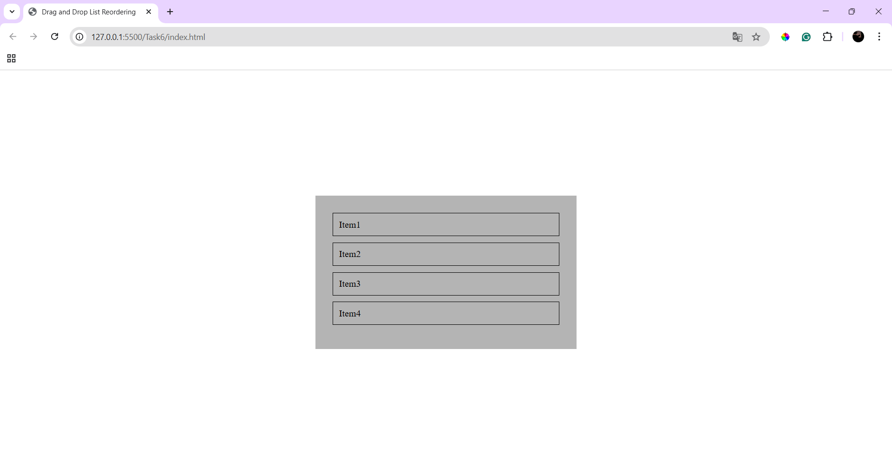
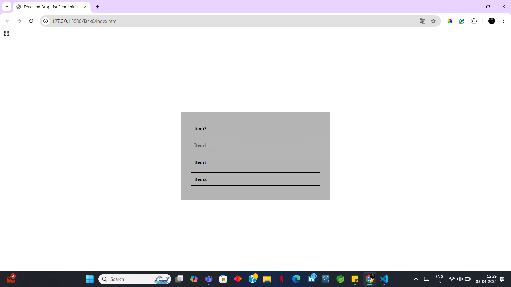

# Drag and Drop List Reordering

## Overview
 Implemented a list that allows users to reorder items using drag and drop functionality.

## New Things Learned
- Learned about **Drag and Drop API** and Used methods such as `dragenter`,`dragstart`,`dragover` and `dragend`.
- Used methods such as `clientY`,`offsetTop` and `offsetHeight` which will give the element's details.
- To update the DOM dynamically I used `insertBefore` which will help to arrange list items.

## Outputs

