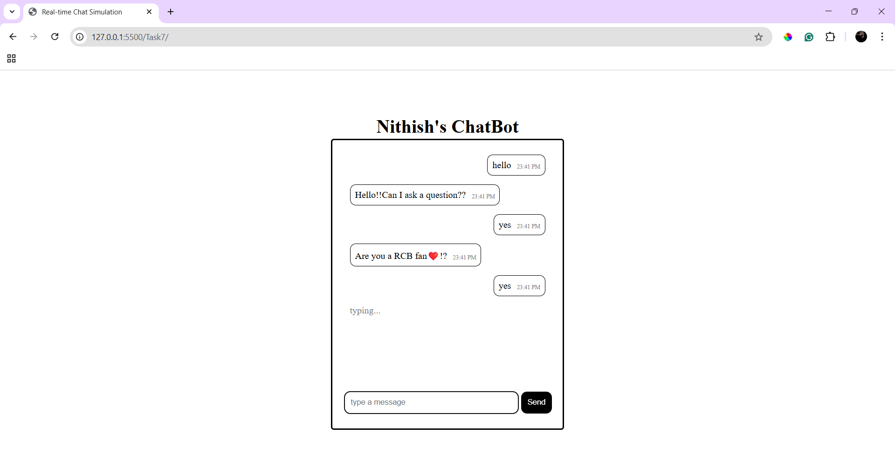
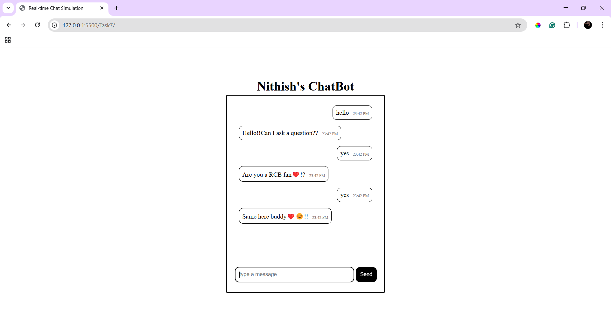

# Real-time Chat Simulation

## Overview
 Developed a chat interface that interact with the user with predefined data.

## New Things Learned
- Used `Date()` method to get the current timestamp and modified it for proper time (HH:MM).
- Used `classList` to add multiple classes to the messages such as **".messsage"**,**".userMessage"** and **".botMessage"**.
- Learned `setTimeout()` for the delay in the incoming message from bot.
- Created predefined sentences(**response[]**) for the user's input.

## Outputs

