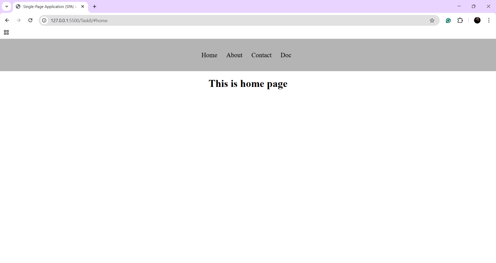
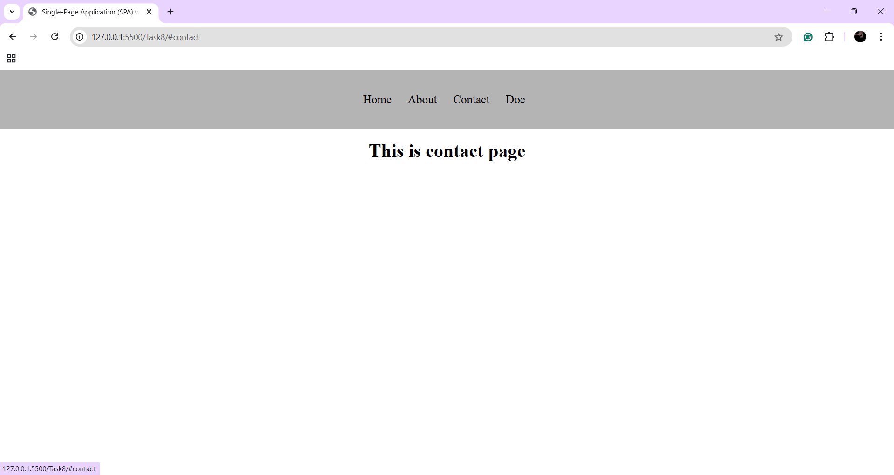

# Single-Page Application (SPA) with Hash-based Routing

## Overview
 Built a basic SPA that navigates between different views without reloading the page.

## New Things Learned
- Learned `hashchange`,`load` and `location.hash` and Used it to detect the **hash changes** in the location URL.
- Used `a` tag for the hash change. If the hash changes it will call the function.
- For the default home page, I set the default hash as `#home`.
```js
     if(!location.hash){
        location.hash = "home";
    }
```
- On initial, The `load` event will occur. When the user click `a` tags(other pages), `hashchange` event will occur.


## Outputs


